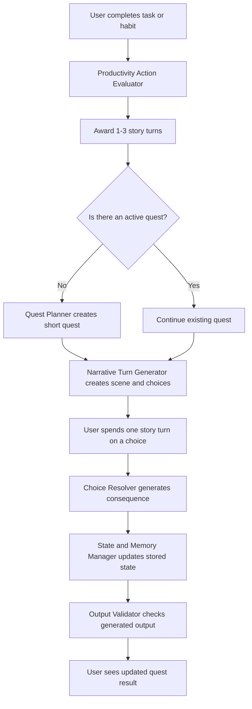

# AI Agent Architecture Document
## Gamified Productivity Quest App

**Date:** May 9, 2026

---

## 1. Architecture Overview
The purpose of the AI architecture is to support the main productivity-to-story loop of the MVP. The application helps students and young professionals turn completed school tasks, work tasks, personal goals, and habits into short AI-generated narrative quests.

The AI system is not designed as a complex autonomous multi-agent system. Instead, the MVP uses a set of specialized AI-assisted backend responsibilities. Each responsibility has a clear purpose, structured inputs, structured outputs, and validation rules.

The AI system supports the following loop:
1. **Productivity action completed**
2. **Story turns awarded**
3. **Story choice selected**
4. **Choice resolved by AI**
5. **Quest state updated**

The application database and stored application state are the source of truth. The AI model should never be treated as the permanent memory of the system. Important information such as active quest state, previous choices, discovered story facts, user preferences, and completed quest history must be stored by the application.

The AI model is used to generate and summarize content, but the application controls what is saved, what is shown, and what is rejected.

---

## 2. AI System Principles
The MVP AI architecture follows these principles:

- **Keep the AI pipeline simple:** Use a small number of AI-assisted responsibilities with clear boundaries.
- **Store important state outside the model:** The AI model should use stored memory as context, but the application should preserve quest continuity.
- **Use structured inputs and outputs:** AI components should receive clear input objects and return JSON-style outputs that are easy to validate.
- **Keep story turns short:** Each AI-generated scene should be brief, readable, and suitable for a mobile-style experience.
- **Keep quests coherent and bounded:** Quests should have a clear premise, limited scope, and expected ending.
- **Prevent contradictory story facts:** The AI should not contradict known quest state, previous choices, or saved story facts.
- **Validate AI output before display:** Generated content should be checked before it reaches the user.
- **Prioritize user productivity over story complexity:** The story exists to motivate real tasks and habits, not to become a full game simulation.

---

## 3. MVP AI Pipeline
The MVP AI pipeline begins when the user completes a task or habit. The system evaluates the completed productivity action, awards story turns, and then allows the user to spend those turns on short story choices.

### High-Level AI Flow:
1. **Task Completion:** The user completes a task or habit.
2. **Evaluation:** The *Productivity Action Evaluator* reviews the action.
3. **Reward:** The system awards 1-3 story turns.
4. **Planning:** The *Quest Planner* creates or initializes a short quest when needed.
5. **Generation:** The *Narrative Turn Generator* creates the next scene and choices.
6. **Selection:** The user selects one choice.
7. **Resolution:** The *Choice Resolver* resolves the selected choice.
8. **Update:** The *State and Memory Manager* updates stored quest state and user memory.
9. **Validation:** The *Output Validator* checks generated content before display.

### 3.1 Flow Diagram


---

## 4. Agent 1: Productivity Action Evaluator
Reviews completed tasks and habits to decide how meaningful the action is and award story turns (1-3). It should encourage the user without over-rewarding trivial tasks.

### 4.1 Responsibilities
- Classify the completed productivity action.
- Estimate complexity and meaningfulness.
- Award 1-3 story turns.
- Produce a short explanation for the reward.

### 4.2 Example Input/Output
**Input:**
```json
{
  "action_type": "task",
  "title": "Finish introduction section of machine learning assignment",
  "description": "Write and revise the first section of the assignment",
  "user_context": "student"
}
```

**Output:**
```json
{
  "classification": "school_task",
  "complexity": "medium",
  "meaningfulness": "high",
  "turns_awarded": 2,
  "reason": "The task is specific, effortful, and contributes to an academic goal."
}
```

---

## 5. Agent 2: Quest Planner
Creates the initial setup for a short AI-generated quest when no active quest exists.

### 5.1 Responsibilities
- Use user genre and tone preferences.
- Create a bounded story premise and setting.
- Establish main objective and starting situation.
- Define expected length (e.g., 8 turns).

### 5.2 Example Output
```json
{
  "quest_title": "The Signal Beneath Europa Station",
  "genre": "sci-fi mystery",
  "tone": "curious, tense, not too dark",
  "premise": "Investigate a silent research station after a strange signal interrupts communication.",
  "main_objective": "Discover the source of the signal and decide its fate.",
  "starting_situation": "Arriving in the main corridor. Lights unstable, communication room locked.",
  "planned_length_in_turns": 8,
  "initial_quest_state": {
    "current_location": "main corridor",
    "known_facts": ["Communication lost", "Signal repeating"],
    "open_questions": ["Who sent the warning?", "What is the signal?"],
    "progress_status": "started"
  }
}
```

---

## 6. Agent 3: Narrative Turn Generator
Creates the next scene (short, readable) and 2-3 text-based choices based on current state.

### 6.1 Choice Types
- **Branching:** Changes the direction of the quest.
- **Progression:** Moves the story forward without a major branch.
- **Investigation:** Reveals information or story facts.
- **Tone:** Allows user expression without changing the main path.

---

## 7. Agent 4: Choice Resolver
Resolves the user’s selected choice and generates a short consequence.

### 7.1 Example Output
```json
{
  "consequence": "You find a maintenance hatch behind a wall panel. It appears used recently.",
  "resolution_type": "progression_with_discovery",
  "new_story_facts": ["Maintenance hatch found", "Used recently"],
  "state_updates": {
    "current_location": "main corridor near maintenance hatch",
    "turns_spent_increment": 1
  },
  "is_quest_complete": false
}
```

---

## 8. Agent 5: State and Memory Manager
Preserves continuity. Mostly deterministic logic, optionally assisted by AI for summarization.

### 8.1 Responsibilities
- Store preferences, productivity history, active quest state, and completed history.
- Provide context to other AI components.
- Ensure the app owns the "Source of Truth," not the AI model.

---

## 9. Agent 6: Output Validator
Checks AI-generated content for safety, structure, and consistency before display.

### 9.1 Excluded Mechanics
The validator rejects or regenerates output that introduces:
- XP, Levels, Stats, Skill trees, Inventory, Combat, Multiplayer.

---

## 10. AI Handoff Flow
Components pass information through structured application state.
- **Productivity Action:** Evaluator → Turns → Memory Update.
- **New Quest:** Planner → State → Turn Generator.
- **Spending Turn:** Resolver → Validator → Memory Manager → Turn Generator.

---

## 11. Error Handling and Fallbacks
- **Evaluator Failure:** Default to 1 story turn for valid actions.
- **Generation Failure:** Ask user to retry or use a simple template.
- **Resolution Contradiction:** Reject and regenerate if AI contradicts stored state.
- **Memory Failure:** Preserve previous valid state.

---

## 12. MVP Boundaries
The AI architecture **DOES NOT**:
- Use autonomous long-term agents.
- Perform deep psychological profiling.
- Simulate a full RPG or open-ended world.
- Include combat, inventory, or complex stats.
- Rely on the model as the source of truth.

---

## 13. Example End-to-End Scenario
1. **Task:** "Finish introduction section of machine learning assignment."
2. **Evaluator:** Award 2 turns.
3. **Quest:** "The Signal Beneath Europa Station."
4. **Turn Generator:** Scene with choices (A: Open door, B: Inspect terminal, C: Search corridor).
5. **Selection:** User selects "Search corridor."
6. **Resolver:** Discovery of maintenance hatch.
7. **Manager:** Update state and available turns (1 remaining).
8. **Validator:** Approved for display.

---

## 14. Final Architecture Definition
The MVP AI Agent Architecture is a lightweight, AI-assisted backend that supports the productivity-to-story loop. It uses specialized roles for evaluation, planning, generation, and resolution while relying on structured application memory as the source of truth.
